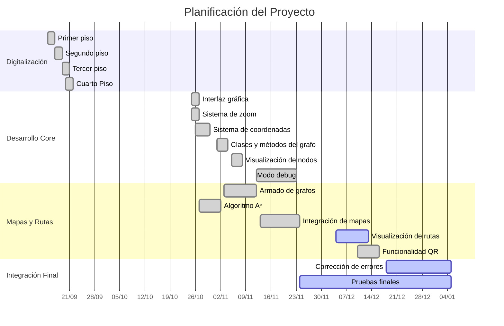

# App Navegación UMAG

<div align="center">

**Sistema de Navegación Interior para la Facultad de Ingeniería**  
*Universidad de Magallanes*

[](https://flutter.dev)
[](https://dart.dev)

</div>

---

## Descripción

Aplicación móvil de navegación interior desarrollada para facilitar la orientación dentro de la Facultad de Ingeniería de la Universidad de Magallanes. El sistema permite a estudiantes, profesores y visitantes encontrar ubicaciones específicas dentro de cada piso del edificio de forma rápida e intuitiva.

### Características Principales

- 🗺️ **Mapas Interactivos**: Visualización de mapas vectoriales (SVG) de los 4 pisos del edificio
- 🔍 **Algoritmo A***: Cálculo óptimo de rutas dentro del mismo piso
- 📱 **Códigos QR**: Identificación de ubicación mediante escaneo de códigos QR estratégicos
- 🎯 **Puntos de Interés**: Identificación de salas, oficinas, laboratorios, baños y más
- 🔄 **Zoom Interactivo**: Controles de zoom suaves con gestos táctiles y botones dedicados
- 📍 **Visualización de Rutas**: Representación visual clara del recorrido sobre el mapa
- 🏗️ **Modelado por Grafos**: Sistema robusto basado en teoría de grafos para navegación precisa
- 🛠️ **Modo Debug**: Herramientas avanzadas para desarrolladores (creación de nodos, conexiones y QR)
- ✅ **Validación de Rutas**: Sistema que asegura origen y destino en el mismo piso

---

## Arquitectura del Proyecto

```
lib/
├── main.dart                          # Punto de entrada y lógica principal
├── models/                            # Modelos de datos
│   ├── nodo.dart                      # Definición de nodos del grafo
│   ├── conexion.dart                  # Conexiones entre nodos
│   └── grafo.dart                     # Estructura del grafo
├── screens/                           # Pantallas de la aplicación
│   ├── pantalla_inicio.dart           # Pantalla principal de inicio
│   ├── pantalla_mapa.dart             # Pantalla del mapa interactivo
│   └── pantalla_ajustes.dart          # Pantalla de configuración
├── painters/                          # Pintores personalizados de Canvas
│   ├── ruta_painter.dart              # Pintor de rutas en el mapa
│   └── conexion_painter.dart          # Pintor de conexiones entre nodos
├── utils/                             # Utilidades y herramientas
│   ├── a_estrella.dart                # Implementación del algoritmo A*
│   ├── codigo_qr.dart                 # Procesamiento de códigos QR
│   ├── constantes.dart                # Constantes de la aplicación
│   ├── grafo_loader.dart              # Carga de datos del grafo
│   ├── helpers.dart                   # Funciones auxiliares
│   ├── navegacion_qr.dart             # Lógica de navegación por QR
│   ├── pantalla_lectora_qr.dart       # Scanner de códigos QR
│   ├── pantalla_seleccion_destino.dart # Selección de destino
│   └── tipos_nodo.dart                # Definición de tipos de nodo
└── data/                              # Datos de los grafos
    ├── grafo_piso1.json               # Nodos y conexiones del piso 1
    ├── grafo_piso2.json               # Nodos y conexiones del piso 2
    ├── grafo_piso3.json               # Nodos y conexiones del piso 3
    └── grafo_piso4.json               # Nodos y conexiones del piso 4
```

---

## Tecnologías Utilizadas

| Tecnología | Propósito |
|------------|-----------|
|  | Framework principal |
|  | Lenguaje de programación |
| **flutter_svg** | Renderizado de mapas vectoriales SVG |
| **mobile_scanner** | Escaneo de códigos QR con cámara |
| **JSON** | Almacenamiento de grafos y nodos |
| **Algoritmo A*** | Búsqueda de caminos óptimos |
| **Material Design 3** | Sistema de diseño de interfaz |

---

## Instalación

### Prerrequisitos

- Flutter SDK 3.0 o superior
- Dart SDK 3.0 o superior
- Android Studio / Xcode (según plataforma)
- Dispositivo físico o emulador configurado

### Pasos de Instalación para Desarrollo

1. **Clonar el repositorio**
   ```bash
   git clone https://github.com/tu-usuario/App_Navegacion_UMAG.git
   cd App_Navegacion_UMAG
   ```

2. **Instalar dependencias**
   ```bash
   flutter pub get
   ```

3. **Verificar configuración de Flutter**
   ```bash
   flutter doctor
   ```

4. **Ejecutar la aplicación**
   ```bash
   flutter run
   ```

### Instalación en Dispositivos Android

#### Opción 1: Compilar e Instalar desde Código Fuente

1. **Conectar dispositivo Android**
   - Habilita las opciones de desarrollador en tu dispositivo
   - Activa la depuración USB
   - Conecta el dispositivo a tu computadora

2. **Verificar conexión del dispositivo**
   ```bash
   flutter devices
   ```

3. **Compilar e instalar directamente**
   ```bash
   flutter install
   ```

#### Opción 2: Generar APK para Instalación Manual

1. **Generar APK de desarrollo**
   ```bash
   flutter build apk --debug
   ```
   El APK se generará en: `build/app/outputs/flutter-apk/app-debug.apk`

2. **Generar APK de producción** (optimizado)
   ```bash
   flutter build apk --release
   ```
   El APK se generará en: `build/app/outputs/flutter-apk/app-release.apk`

3. **Transferir e instalar el APK**
   - Transfiere el archivo APK a tu dispositivo Android
   - Habilita "Instalar aplicaciones de fuentes desconocidas" en configuración
   - Abre el archivo APK desde el administrador de archivos
   - Sigue las instrucciones para completar la instalación

#### Opción 3: APK de github release
- Descargar la version disponible en Github.
- Instalarla, habiendo activado previamente la instalacion desde fuentes desconocidas (La aplicación no es un virus).
- Usarla.

---

## Uso

### Navegación Básica

1. **Seleccionar Piso**: En la pantalla principal, elige el piso que deseas explorar
2. **Visualizar Mapa**: Explora el mapa interactivo con gestos de zoom y desplazamiento
3. **Buscar Ubicación**: Toca sobre cualquier nodo para ver información detallada del lugar
4. **Establecer Ruta**: 
   - Selecciona un nodo como origen (punto de partida)
   - Selecciona un nodo como destino en el **mismo piso**
   - La aplicación calculará automáticamente la ruta óptima usando A*
   - La ruta se visualiza con líneas azules sobre el mapa

> **Nota:** Actualmente, origen y destino deben estar en el mismo piso. Para navegar a otro piso, regresa al menú principal y selecciona el piso destino.

### Navegación por QR

1. Toca el botón del escáner QR en la pantalla del mapa
2. Escanea un código QR ubicado en el edificio
3. El sistema identificará tu ubicación actual
4. Selecciona tu destino del menú desplegable
5. La aplicación calculará y mostrará la ruta óptima
6. Sigue la visualización de la ruta en el mapa

### Tipos de Nodos

| Tipo | Descripción | Icono Material |
|------|-------------|----------------|
| **Entrada** | Accesos principales del edificio | `door_front_door` |
| **Pasillo** | Puntos intermedios en corredores | `straighten` |
| **Intersección** | Cruces de pasillos | `merge_type` |
| **Esquina** | Cambios de dirección | `turn_right` |
| **Puerta** | Acceso a salas/oficinas | `meeting_room` |
| **Escalera** | Conexión vertical entre pisos | `stairs` |
| **Ascensor** | Conexión vertical automatizada | `elevator` |
| **Baño** | Servicios higiénicos | `wc` |
| **Laboratorio** | Laboratorios de investigación | `science` |
| **Sala de Clases** | Aulas para clases | `class_` |
| **Punto de Interés** | Lugares relevantes (cafetería, oficinas, etc.) | `place` |

#### Códigos de Color

- 🟢 **Verde** - Entradas
- 🔵 **Azul** - Pasillos
- 🟠 **Naranja** - Intersecciones
- 🟣 **Púrpura** - Esquinas
- 🔷 **Teal** - Puertas
- 🔴 **Rojo** - Escaleras
- 🟦 **Índigo** - Ascensores
- 🔵 **Cian** - Baños
- 🟢 **Verde Claro** - Laboratorios
- 🔵 **Azul Claro** - Salas de Clases
- 🟡 **Amarillo** - Puntos de Interés

---

## Modo Debug (Desarrolladores)

El modo debug está activado mediante la constante `kDebugMode = true` en [main.dart](lib/main.dart).

### Funcionalidades Debug

- ✏️ **Crear Nodos**: Toca en el mapa para agregar nuevos nodos con tipo específico
- 🔗 **Crear Conexiones**: Define conexiones bidireccionales entre nodos con cálculo automático de distancia
- 📊 **Estadísticas**: Visualiza información del grafo por tipo de nodo
- 📤 **Exportar Datos**: Copia nodos y conexiones al portapapeles en formato JSON
- 🔄 **Recargar Nodos**: Actualiza los nodos desde el archivo JSON sin reiniciar
- 🔧 **Migrar Nodos**: Herramienta para agregar tipos a nodos existentes
- 🔍 **Diagnóstico**: Verifica la integridad del grafo y archivos
- 📱 **Generar QR**: Crea códigos QR para cualquier nodo

---

## Algoritmo A* (A-Estrella)

El sistema utiliza el algoritmo A* para calcular las rutas óptimas dentro de cada piso:

- **Heurística**: Distancia euclidiana entre nodos (coordenadas x, y)
- **Costo Real**: Distancia acumulada desde el nodo origen
- **Función de Evaluación**: `f(n) = g(n) + h(n)`
  - `g(n)` = costo real acumulado desde el origen hasta el nodo n
  - `h(n)` = estimación heurística desde n hasta el destino
- **Optimización**: Encuentra el camino más corto garantizado (óptimo) cuando la heurística es admisible
- **Implementación**: Ubicada en `lib/utils/a_estrella.dart`

### Ventajas sobre Dijkstra
- ✅ Más eficiente: explora menos nodos
- ✅ Dirigida por objetivo: usa la heurística para priorizar nodos prometedores
- ✅ Óptima: garantiza encontrar el camino más corto
- ✅ Escalable: funciona bien con grafos de más de 100 nodos

---

## Estructura de Datos del Grafo

Los archivos JSON en `lib/data/` siguen esta estructura:

```json
{
  "nodos": [
    {
      "id": "P1_ENTRADA_PRINCIPAL",
      "x": 600.0,
      "y": 750.0,
      "tipo": "entrada",
      "nombre": "Entrada Principal",
      "descripcion": "Acceso principal del edificio"
    }
  ],
  "conexiones": [
    {
      "origen": "P1_ENTRADA_PRINCIPAL",
      "destino": "P1_PASILLO_01",
      "distancia": 50,
      "bidireccional": true
    }
  ]
}
```

### Tipos de Nodo Disponibles

Los siguientes tipos están definidos en el enum `TipoNodo` (main.dart):

- `entrada` - Entradas principales
- `pasillo` - Puntos en pasillos
- `interseccion` - Cruces de pasillos
- `esquina` - Cambios de dirección
- `puerta` - Accesos a salas
- `escalera` - Conexiones verticales
- `ascensor` - Ascensores
- `bano` - Servicios higiénicos
- `laboratorio` - Laboratorios
- `salaClases` - Salas de clases
- `puntoInteres` - Lugares destacados

---

## Carta Gantt del Proyecto

<details>
<summary>Ver planificación completa del desarrollo</summary>



</details>

---

## Contribuidores

<table>
  <tr>
    <th>Avatar</th>
    <th>Nombre</th>
    <th>Rol</th>
    <th>Contribuciones</th>
  </tr>
  <tr>
    <td>👨‍💻</td>
    <td>Diego Vidal</td>
    <td>Desarrollador Principal</td>
    <td>Interfaz, sistema de navegación, modo debug, corrección de errores QR</td>
  </tr>
  </table>

---

## Contribuir

Las contribuciones son bienvenidas. Para cambios importantes:

1. Fork el proyecto
2. Crea una rama para tu función (`git checkout -b feature/NuevaFuncion`)
3. Commit tus cambios (`git commit -m 'Agregar nueva función'`)
4. Push a la rama (`git push origin feature/NuevaFuncion`)
5. Abre un Pull Request

---

## Contacto

**Universidad de Magallanes**  
Facultad de Ingeniería

- 📍 Punta Arenas, Región de Magallanes, Chile
- 🌐 [www.umag.cl](https://www.umag.cl)

---

## Agradecimientos

- Universidad de Magallanes por el apoyo institucional
- Facultad de Ingeniería por proporcionar los planos del edificio
- Comunidad Flutter por las librerías de código abierto

---