# 🧭 App Navegación UMAG

<div align="center">

**Sistema de Navegación Interior para la Facultad de Ingeniería**  
*Universidad de Magallanes*

[](https://flutter.dev)
[](https://dart.dev)

</div>

---

## 📋 Descripción

Aplicación móvil de navegación interior desarrollada para facilitar la orientación dentro de la Facultad de Ingeniería de la Universidad de Magallanes. El sistema permite a estudiantes, profesores y visitantes encontrar ubicaciones específicas dentro de cada piso del edificio de forma rápida e intuitiva.

### ✨ Características Principales

- 🗺️ **Mapas Interactivos**: Visualización de mapas vectoriales (SVG) de los 4 pisos del edificio
- 🔍 **Algoritmo A***: Cálculo óptimo de rutas dentro del mismo piso
- 📱 **Códigos QR**: Identificación de ubicación mediante escaneo de códigos QR estratégicos
- 🎯 **Puntos de Interés**: Identificación de salas, oficinas, laboratorios, baños y más
- 🔄 **Zoom Interactivo**: Controles de zoom suaves con gestos táctiles y botones dedicados
- 📍 **Visualización de Rutas**: Representación visual clara del recorrido sobre el mapa
- 🏗️ **Modelado por Grafos**: Sistema robusto basado en teoría de grafos para navegación precisa
- 🛠️ **Modo Debug**: Herramientas avanzadas para desarrolladores (creación de nodos, conexiones y QR)
- ✅ **Validación de Rutas**: Sistema que asegura origen y destino en el mismo piso

---

## 🏗️ Arquitectura del Proyecto

```
lib/
├── main.dart                          # Punto de entrada y lógica principal
├── models/                            # Modelos de datos
│   ├── nodo.dart                      # Definición de nodos del grafo
│   ├── conexion.dart                  # Conexiones entre nodos
│   └── grafo.dart                     # Estructura del grafo
├── utils/                             # Utilidades y herramientas
│   ├── a_estrella.dart                # Implementación del algoritmo A*
│   ├── codigo_qr.dart                 # Procesamiento de códigos QR
│   ├── grafo_loader.dart              # Carga de datos del grafo
│   ├── navegacion_qr.dart             # Lógica de navegación por QR
│   ├── pantalla_lectora_qr.dart       # Scanner de códigos QR
│   └── pantalla_seleccion_destino.dart # Selección de destino
└── data/                              # Datos de los grafos
    ├── grafo_piso1.json               # Nodos y conexiones del piso 1
    ├── grafo_piso2.json               # Nodos y conexiones del piso 2
    ├── grafo_piso3.json               # Nodos y conexiones del piso 3
    └── grafo_piso4.json               # Nodos y conexiones del piso 4
```

---

## 🚀 Tecnologías Utilizadas

| Tecnología | Propósito |
|------------|-----------|
|  | Framework principal |
|  | Lenguaje de programación |
| **flutter_svg** | Renderizado de mapas vectoriales SVG |
| **mobile_scanner** | Escaneo de códigos QR con cámara |
| **JSON** | Almacenamiento de grafos y nodos |
| **Algoritmo A*** | Búsqueda de caminos óptimos |
| **Material Design 3** | Sistema de diseño de interfaz |

---

## 📦 Instalación

### Prerrequisitos

- Flutter SDK 3.0 o superior
- Dart SDK 3.0 o superior
- Android Studio / Xcode (según plataforma)
- Dispositivo físico o emulador configurado

### Pasos de Instalación

1. **Clonar el repositorio**
   ```bash
   git clone https://github.com/tu-usuario/App_Navegacion_UMAG.git
   cd App_Navegacion_UMAG
   ```

2. **Instalar dependencias**
   ```bash
   flutter pub get
   ```

3. **Verificar configuración de Flutter**
   ```bash
   flutter doctor
   ```

4. **Ejecutar la aplicación**
   ```bash
   flutter run
   ```

---

## 🎮 Uso

### Navegación Básica

1. **Seleccionar Piso**: En la pantalla principal, elige el piso que deseas explorar
2. **Visualizar Mapa**: Explora el mapa interactivo con gestos de zoom y desplazamiento
3. **Buscar Ubicación**: Toca sobre cualquier nodo para ver información detallada del lugar
4. **Establecer Ruta**: 
   - Selecciona un nodo como origen (punto de partida)
   - Selecciona un nodo como destino en el **mismo piso**
   - La aplicación calculará automáticamente la ruta óptima usando A*
   - La ruta se visualiza con líneas azules sobre el mapa

> **Nota:** Actualmente, origen y destino deben estar en el mismo piso. Para navegar a otro piso, regresa al menú principal y selecciona el piso destino.

### Navegación por QR

1. Toca el botón del escáner QR en la pantalla del mapa
2. Escanea un código QR ubicado en el edificio
3. El sistema identificará tu ubicación actual
4. Selecciona tu destino del menú desplegable
5. La aplicación calculará y mostrará la ruta óptima
6. Sigue la visualización de la ruta en el mapa

### Tipos de Nodos

| Icono | Tipo | Descripción |
|-------|------|-------------|
| 🚪 | Entrada | Accesos principales del edificio |
| 🔀 | Intersección | Cruces de pasillos |
| 📐 | Esquina | Cambios de dirección |
| 🚪 | Puerta | Acceso a salas/oficinas |
| 🪜 | Escalera | Conexión vertical entre pisos |
| 🛗 | Ascensor | Conexión vertical automatizada |
| 🚻 | Baño | Servicios higiénicos |
| ⭐ | Punto de Interés | Lugares destacados |

---

## 🛠️ Modo Debug (Desarrolladores)

El modo debug está activado mediante la constante `kDebugMode = true` en [main.dart](lib/main.dart).

### Funcionalidades Debug

- ✏️ **Crear Nodos**: Toca en el mapa para agregar nuevos nodos
- 🔗 **Crear Conexiones**: Define conexiones bidireccionales entre nodos
- 📊 **Estadísticas**: Visualiza información del grafo
- 📤 **Exportar Datos**: Copia nodos y conexiones al portapapeles en formato JSON
- 🔍 **Diagnóstico**: Verifica la integridad del grafo
- 📱 **Generar QR**: Crea códigos QR para cualquier nodo

---

## 📊 Algoritmo A* (A-Estrella)

El sistema utiliza el algoritmo A* para calcular las rutas óptimas dentro de cada piso:

- **Heurística**: Distancia euclidiana entre nodos (coordenadas x, y)
- **Costo Real**: Distancia acumulada desde el nodo origen
- **Función de Evaluación**: `f(n) = g(n) + h(n)`
  - `g(n)` = costo real acumulado desde el origen hasta el nodo n
  - `h(n)` = estimación heurística desde n hasta el destino
- **Optimización**: Encuentra el camino más corto garantizado (óptimo) cuando la heurística es admisible
- **Implementación**: Ubicada en `lib/utils/a_estrella.dart`

### Ventajas sobre Dijkstra
- ✅ Más eficiente: explora menos nodos
- ✅ Dirigida por objetivo: usa la heurística para priorizar nodos prometedores
- ✅ Óptima: garantiza encontrar el camino más corto
- ✅ Escalable: funciona bien con grafos de más de 100 nodos

---

## 🗺️ Estructura de Datos del Grafo

Los archivos JSON en `lib/data/` siguen esta estructura:

```json
{
  "nodos": [
    {
      "id": "P1_ENTRADA_PRINCIPAL",
      "x": 600.0,
      "y": 750.0,
      "tipo": "entrada",
      "nombre": "Entrada Principal",
      "descripcion": "Acceso principal del edificio"
    }
  ],
  "conexiones": [
    {
      "origen": "P1_ENTRADA_PRINCIPAL",
      "destino": "P1_PASILLO_01",
      "distancia": 50,
      "bidireccional": true
    }
  ]
}
```

---

## 📈 Carta Gantt del Proyecto

```mermaid
gantt
    title Planificación del Proyecto
    dateFormat YYYY-MM-DD
    axisFormat %d/%m

    section Digitalización
    Primer piso                           :done, 2025-09-15, 2d
    Segundo piso                          :done, 2025-09-17, 2d
    Tercer piso                           :done, 2025-09-19, 2d
    Cuarto Piso                           :done, 2025-09-20, 2d

    section Desarrollo Core
    Interfaz gráfica                      :done, 2025-10-25, 2d
    Sistema de zoom                       :done, 2025-10-25, 2d
    Sistema de coordenadas                :done, 2025-10-26, 4d
    Clases y métodos del grafo            :done, 2025-11-01, 3d
    Visualización de nodos                :done, 2025-11-05, 3d
    Modo debug                            :done, 2025-11-12, 11d

    section Mapas y Rutas
    Armado de grafos                      :done, 2025-11-03, 9d
    Algoritmo A*                          :done, 2025-10-27, 6d
    Integración de mapas                  :done, 2025-11-13, 11d
    Visualización de rutas                :active, 2025-12-04, 9d
    Funcionalidad QR                      :done, 2025-12-10, 6d

    section Integración Final
    Corrección de errores                 :active, 2025-12-18, 18d
    Pruebas finales                       :active, 2025-11-24, 42d
```

<details>
<summary>Ver planificación completa del desarrollo</summary>



</details>

---

## 👥 Contribuidores

| Avatar | Nombre | Rol | Contribuciones |
|--------|--------|-----|----------------|
| 👨‍💻 | Diego Vidal | Desarrollador Principal | Interfaz, sistema de navegación, modo debug, corrección de errores QR |
| 👨‍💻 | Bruno Martinez | Desarrollador | Digitalización de mapas, modelado de grafos, algoritmo A*, sistema de coordenadas |

---

## 🤝 Contribuir

Las contribuciones son bienvenidas. Para cambios importantes:

1. Fork el proyecto
2. Crea una rama para tu función (`git checkout -b feature/NuevaFuncion`)
3. Commit tus cambios (`git commit -m 'Agregar nueva función'`)
4. Push a la rama (`git push origin feature/NuevaFuncion`)
5. Abre un Pull Request

---

## 📧 Contacto

**Universidad de Magallanes**  
Facultad de Ingeniería

- 📍 Punta Arenas, Región de Magallanes, Chile
- 🌐 [www.umag.cl](https://www.umag.cl)

---

## 🙏 Agradecimientos

- Universidad de Magallanes por el apoyo institucional
- Facultad de Ingeniería por proporcionar los planos del edificio
- Comunidad Flutter por las librerías de código abierto

---
