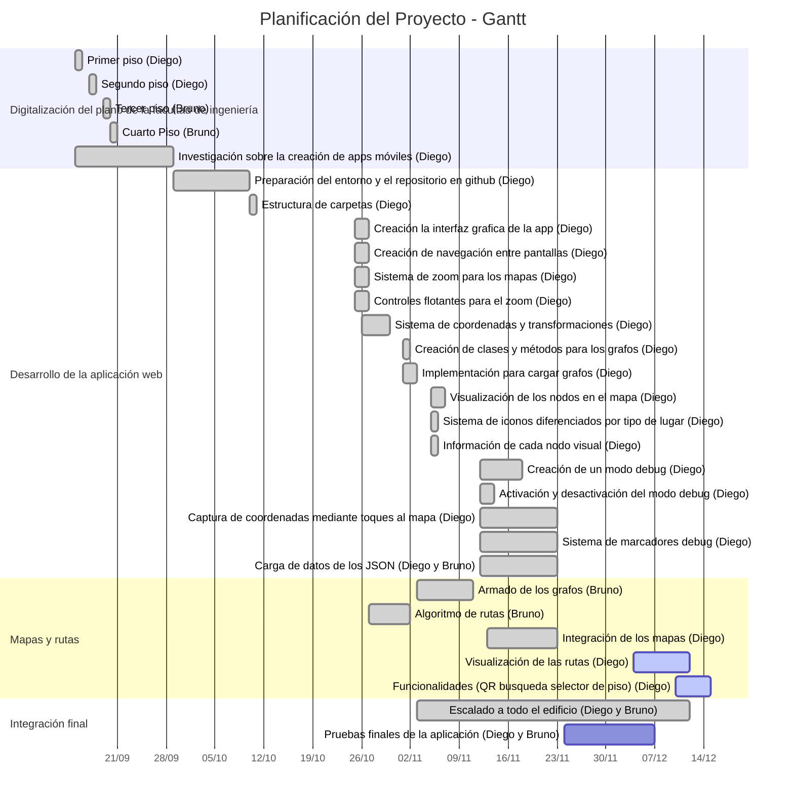

```mermaid
gantt
    title Planificación del Proyecto - Gantt
    dateFormat YYYY-MM-DD
    axisFormat %d/%m

    section Digitalización del plano de la facultad de ingeniería
    Primer piso (Diego)                          :done, des1, 2025-09-15, 2025-09-16
    Segundo piso (Diego)                         :done, des2, 2025-09-17, 2025-09-18
    Tercer piso (Bruno)                          :done, des3, 2025-09-19, 2025-09-20
    Cuarto Piso (Bruno)                          :done, des4, 2025-09-20, 2025-09-21
    Investigación sobre la creación de apps móviles (Diego) :done, des5, 2025-09-15, 2025-09-29

    section Desarrollo de la aplicación web
    Preparación del entorno y el repositorio en github (Diego) :done, dev0, 2025-09-29, 2025-10-10
    Estructura de carpetas (Diego)               :done, dev1, 2025-10-10, 1d
    Creación la interfaz grafica de la app (Diego) :done, dev2, 2025-10-25, 2d
    Creación de navegación entre pantallas (Diego):done, dev3, 2025-10-25, 2d
    Sistema de zoom para los mapas (Diego)      :done, dev4, 2025-10-25, 2d
    Controles flotantes para el zoom (Diego)    :done, dev5, 2025-10-25, 2d
    Sistema de coordenadas y transformaciones (Diego):done, dev6, 2025-10-26, 4d
    Creación de clases y métodos para los grafos (Diego) :done, dev7, 2025-11-01, 1d
    Implementación para cargar grafos (Diego)    :done, dev8, 2025-11-01, 2d
    Visualización de los nodos en el mapa (Diego):done, dev9, 2025-11-05, 2d
    Sistema de iconos diferenciados por tipo de lugar (Diego) :done, dev10, 2025-11-05, 1d
    Información de cada nodo visual (Diego)              :done, dev11, 2025-11-05, 1d
    Creación de un modo debug (Diego)                    :done, dev12, 2025-11-12, 6d
    Activación y desactivación del modo debug (Diego)    :done, dev13, 2025-11-12, 2d
    Captura de coordenadas mediante toques al mapa (Diego) :done, dev14, 2025-11-12, 11d
    Sistema de marcadores debug (Diego)                  :done, dev15, 2025-11-12, 11d
    Carga de datos de los JSON (Diego y Bruno)                   :done, dev16, 2025-11-12, 11d

    section Mapas y rutas
    Armado de los grafos (Bruno)                 :done, dev17, 2025-11-03, 2025-11-11
    Algoritmo de rutas (Bruno)                   :done, dev18, 2025-10-27, 6d
    Integración de los mapas (Diego)             :done, dev19, 2025-11-13, 2025-11-23
    Visualización de las rutas (Diego)           :active, dev20, 2025-12-4, 2025-12-12
    Funcionalidades (QR busqueda selector de piso) (Diego) :active, dev21, 2025-12-10, 2025-12-15

    section Integración final
    Escalado a todo el edificio (Diego y Bruno)  :done, dev22, 2025-11-03, 2025-12-12
    Pruebas finales de la aplicación (Diego y Bruno) :dev23, 2025-11-24, 2025-12-07
```
